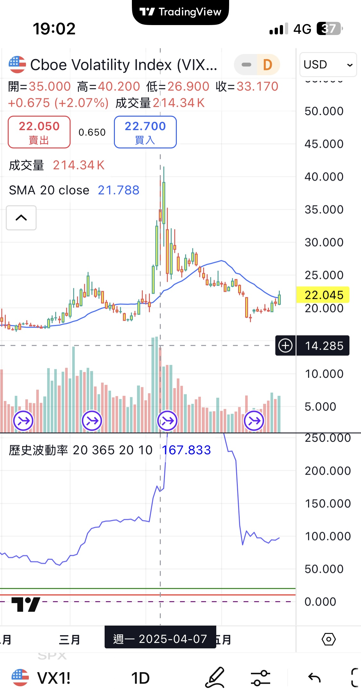
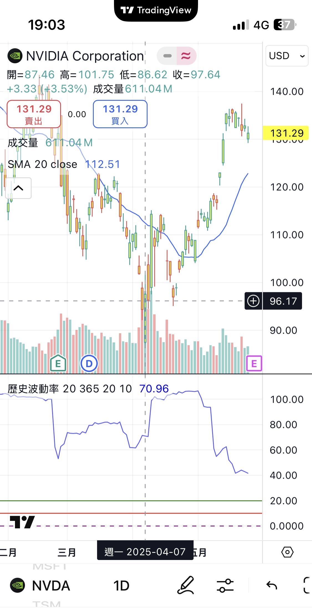

# alpha-vix-strategy-v1
A volatility-based US equity strategy triggered by VIX levels.
# VIX-Based Regime Strategy (Alpha V1)

This strategy is based on the volatility regime framework using the VIX index as the primary trigger. It is designed to enter high-quality equities during elevated volatility, and to reduce or avoid exposure in calm markets. A secondary alpha layer based on technical patterns (such as candlestick formations or breakout structures) is added to prevent false entries.

## Core Logic

- **VIX > 30**: Initiate positions in selected growth stocks or sector leaders.
- **25 < VIX <= 30**: Add to positions if price action confirms strength.
- **VIX < 20**: No new entries; potential for reducing exposure.
- **Technical Overlay**: Entry requires confirmation from a bullish technical signal (e.g., bullish engulfing, breakout above resistance, or strong RSI rebound). This layer is designed to filter out false entries, as seen in recent cases like PEP.

## Actual Entry Log

- **NVDA**: Position initiated on **April 7, 2025** at $88.35 (33 shares), during a short-term volatility spike when VIX exceeded 25. Entry confirmed by bullish breakout pattern and continued strength in AI sector leaders.
- **MSFT**: Acquired simultaneously at $350.91 (8.5492 shares) as a core anchor to balance volatility exposure.

This real-world entry aligns with the model’s logic of initiating positions when VIX is between 25–30, combined with technical confirmation.

## Chart Examples

**VIX Breakout on Entry Date (April 7, 2025)**  

**NVDA Breakout Confirmation (April 7, 2025)**  

## Risk Management

- Avoid chasing in VIX < 20 zones.
- Use stop-loss based on recent swing lows or volatility bands.
- Reassess technical patterns after each VIX regime shift.

## Files

- `strategy_core.ipynb`: Core logic in Python
- `images/`: Chart samples
- `data/`: (Optional) Add VIX and equity data
